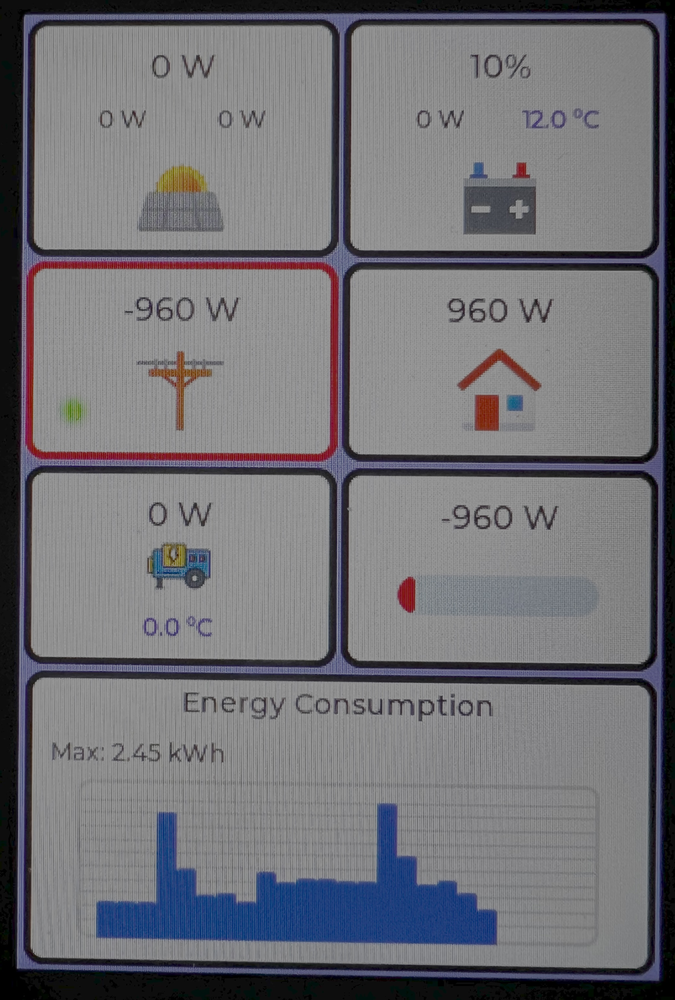
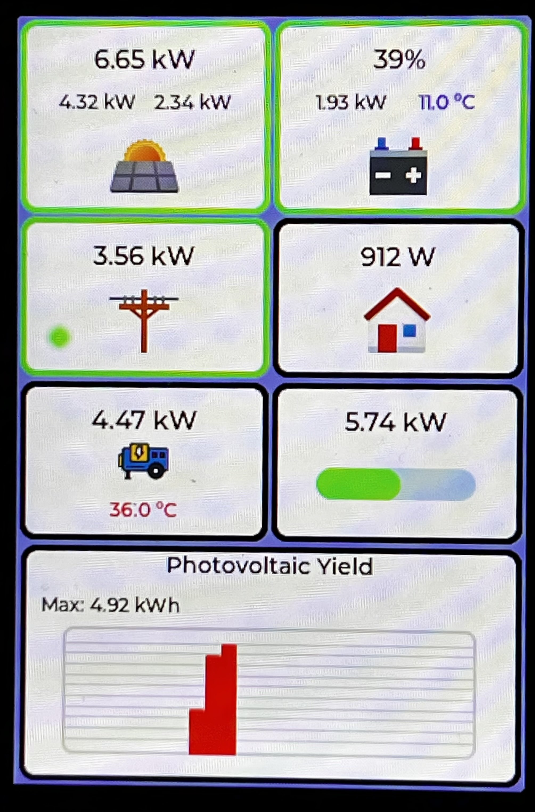
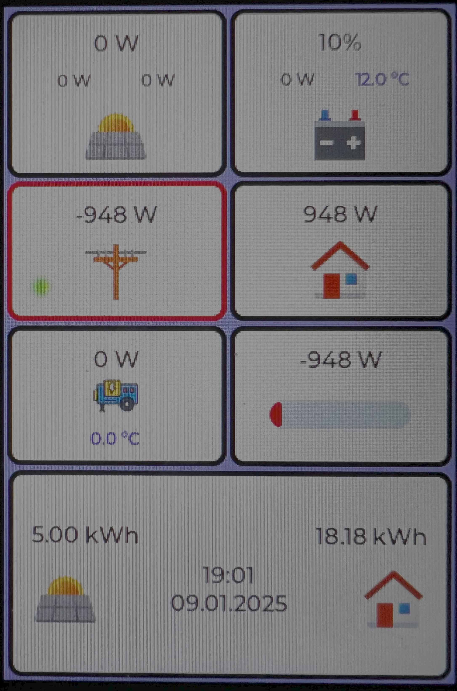
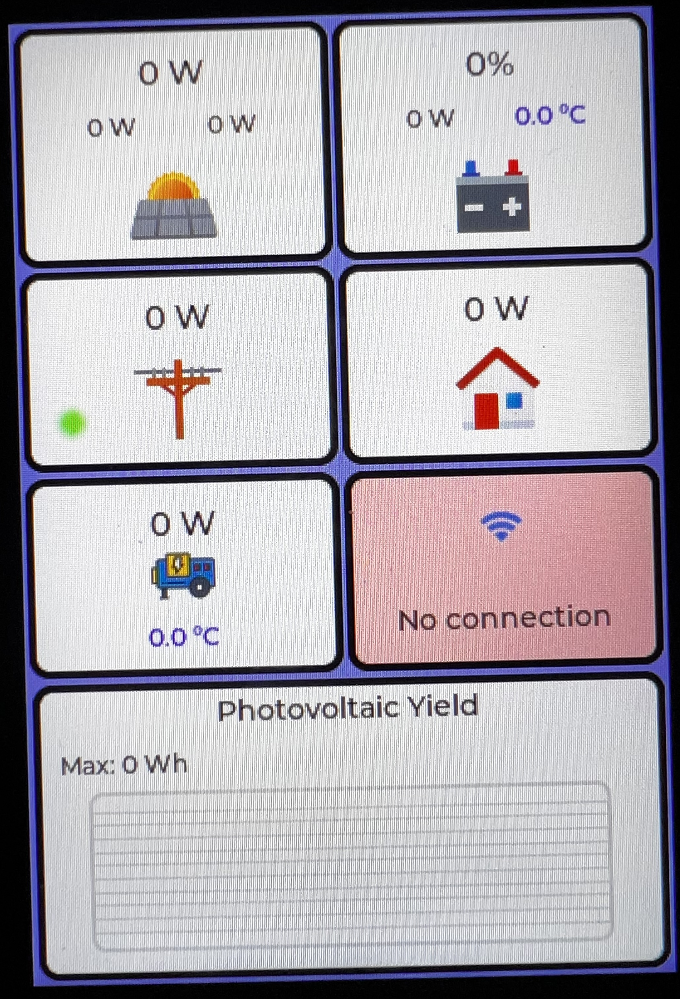
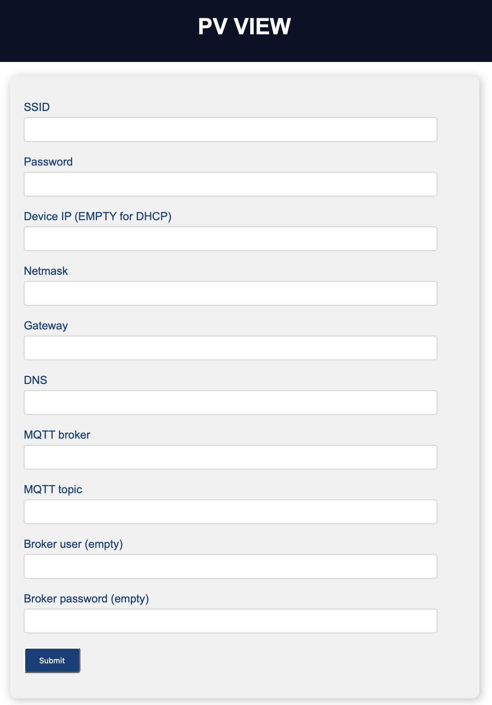

# Photovoltaic view
The PV View project serves as a small data monitor for photovoltaic power plants. Data without mqtt source. In general, it can be used for any photovoltaic power plant. One possible source is e.g. the solax gateway, which provides data from the solar power plant to a predefined mqtt topic (see [solax gtw](https://github.com/xventus/solax_gtw)).  The project is written directly for the ESP IDF SDK.
## Hardware
This view is based on the SC01 Plus display.

[Link to WT32 SC01 Plus](https://en.wireless-tag.com/product-item-26.html)

## UI

The tiles on the display show the individual parts of the PV system. 

The top left shows the total power delivered from the PV panels. Below the total output value are the outputs of the individual strings. If the framing of the tile is green, it means that it is supplying power to the system. On the right is the battery storage. SOC, power delivered or received, and temperature. Red framing indicates that power is being drawn from the battery, green framing indicates that the battery is charging. 

The next row then indicates the actual power drawn from the electrical site (red framing) or the power supplied to the site (green framing).

The green LED indicates that it is connected to the grid. Red indicates it is off grid. 

The engine icon represents the inverter performance and temperature. By clicking on it you can go to the AP activation for setting purposes.

The bar graph on the right shows the free power accumulation. In case the free power is not available, it is shown in red and it is the consumption that is not covered by PV or battery. If the bar graph is green, on the other hand, it shows how much free power is available.

By clicking on the graph you can switch between the display of energy consumption days, energy production days and text display.

Most PV system graphs show the current performance per case. This shows the energy produced/consumed in time per hour. Useful for a quick understanding of how much energy has been produced and consumed during each hour of the day.
Provides information on overall daily trends, which is useful for planning and optimization.

Note: In the graph the information about "Max" indicates the maximum energy consumption/production during the day (Wh). The sum of all energies is in the text part.

<table>
    <tr>
        <td></td>
        <td></td>
        <td></td>
        <td></td>
     </tr>
</table>

---

## Firmware

Configuration is done via the web browser and connection to the Access Point, which is activated after clicking on the AP button. Click on the engine icon (on the left side) to display the AP launch screen through which you can configure the view. Connect to the AP and connect to 192.168.4.1 in the browser to perform the configuration. Configure your site's AP access and IP address and the MQTT topic that provides the data.

Note: The SD card is used to store daily statistics during power failure. If the SD card is not inserted, the statistics are stored only in RAM. 

<table>
    <tr>
        <td></td>
     </tr>
</table>

## TODO

- Fix ResetTask - when a reboot is requested, the task crashes and then restarts.
- Fix unsubscribe call when connection is lost.
-   

