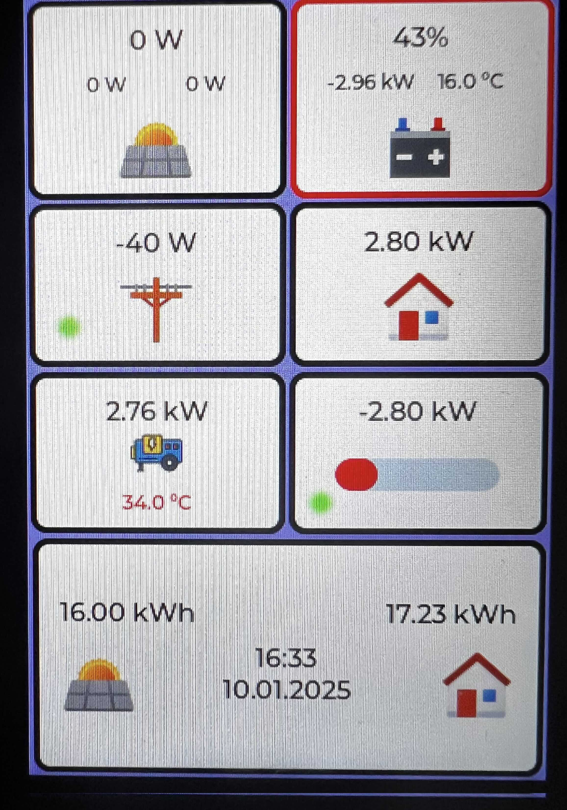
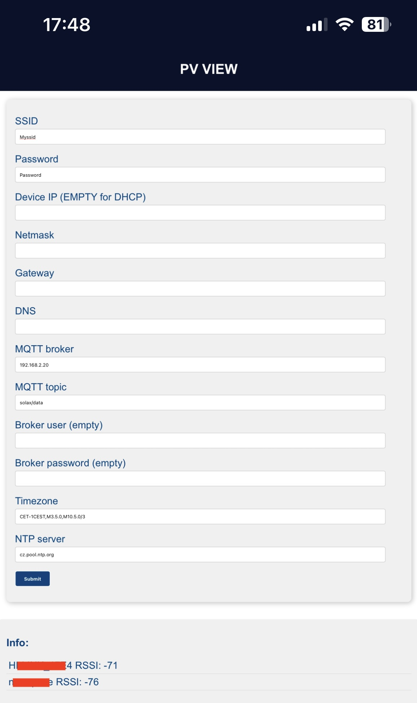

# Photovoltaic view
The PV View project serves as a small data monitor for photovoltaic power plants. Data without mqtt source. In general, it can be used for any photovoltaic power plant. One possible source is e.g. the solax gateway, which provides data from the solar power plant to a predefined mqtt topic (see [solax gtw](https://github.com/xventus/solax_gtw)).  The project is written directly for the ESP IDF SDK.
## Hardware
This view is based on the SC01 Plus display.

[Link to WT32 SC01 Plus](https://en.wireless-tag.com/product-item-26.html)

<table>
    <tr>
        <td></td>
        <td></td>
        <td></td>
        <td></td>
     </tr>
</table>

---

## Firmware

Configuration is done via the web browser and connection to the Access Point, which is activated after clicking on the AP button. Click on the engine icon (on the left side) to display the AP launch screen through which you can configure the view. Connect to the AP and connect to 192.168.4.1 in the browser to perform the configuration. Configure your site's AP access and IP address and the MQTT topic that provides the data.

<table>
    <tr>
        <td></td>
     </tr>
</table>

